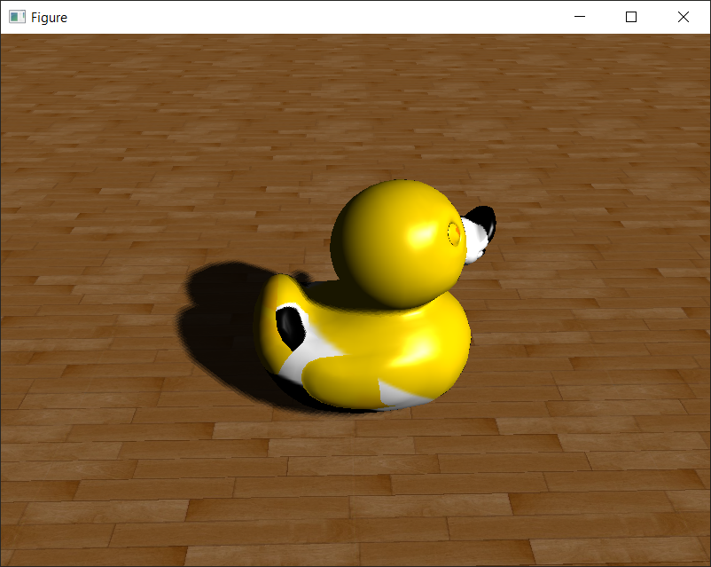

# GLASS -- Use easiest way to render 3D scene

## 1  Getting Start

**GLASS** is an open source, cross-platform, object-oriented 3D rendering engine for C++. **GLASS** is built totally based on **OpenGL 4.6**. By using **GLASS**, you can build your VR scene in a very intuitive way. How intuitive? Just see following example:
```c++
#include "glass/Scene3D"
#include "glass/utils/geometry.h"

int main()
{
	Scene3D scene;
	// Create Scene3D object

	scene.models["floor"] = glass::floor();
	// Add floor model

	scene.models["floor"].setTexture("floor.png");
	// Set floor texture as "floor.png"

	scene.models["duck"].load("duck/duck.dae");
	// Add duck model

	scene.models["duck"].zoom(0.01);
	// Zoom duck size to scale 0.01

	scene.dir_lights["light"].setDirection(-1, -1, -1);
	// Add a direction light and set direction as (-1, -1, -1)

	scene.dir_lights["light"].useShadow();
	// Turn on shadow for this light,
	// otherwise all models won't have shadow.

	scene.show();
	// Show the scene
}
```
Run the code then you will see following window.



You can use mouse and key to navigate in the scene:

* Mouse move to see around and up/down;
* <kbd>W</kbd> to move forward;
* <kbd>S</kbd> to move back;
* <kbd>A</kbd> to move left;
* <kbd>D</kbd> to move right;
* <kbd>E</kbd> to move up;
* <kbd>C</kbd> to move down;
* <kbd>ESC</kbd> to exit navigation mode and show the cursor;
* <kbd>Enter</kbd> to enter navigation mode again.

Click [demos]() to see more demos.

Above example is using **GLASS** high level interface. **GLASS** library also provide a lot of interfaces for OpenGL core programming directly. See more details at [low level programming using GLASS]().

If you want to learn systematically about **GLASS**, [Tutorial]() will guide you step-by-step to build your more and more complicated VR world. [Manual]() is a comprehensive document for all the usage of **GLASS**. And [API Reference]() explain all the interfaces in details.

(Note: All url links are not available now. The coffee money you donate will accelerate the document writting process.)

## 2  Why GLASS

The reason is simple, because **GLASS** is simple. Simple and intuitive is the core philosophy of **GLASS**. As you see the code above, every line of code just work as it's literal meaning. That's very friendly for 3D developement beginer. And more, here lists all the features of **GLASS**:

* **User friendly interface**: Compared to other 3D rendering engines, **GLASS** has the easiest interface and the most intuitive programming style.
* **Multi abstraction levels**: Beginer can use high level interface. For higher controllable developement, you can introduce more 3D rendering objects to build your scene. And for more degree of freedom developement, you can also introduce OpenGL objects. And even more, you can use **GLASS** just for OpenGL core mode programming: pass data to GPU, tell GPU to do something... in **GLASS** way.
* **Open source**: **GLASS** is released under [MIT Licence]. You can use **GLASS** in your commercial software freely.
* **Cross-platform**: **GLASS** is based on OpenGL. Because OpenGL is cross-platform, you can use **GLASS** to all devices that support OpenGL: desktop application(Windows/Linux/Mac), embedded firmware(Android/IOS/Other Embedded OS) and after the API for JavaScript is ready, web application will also be OK.
* **Cross-language**: It will be. But not now. **GLASS** will support pure C, Python, Java, JavaScript. Because **GLASS** is not just an API for one specific language, but also an architecture idea for 3D programming. This idea will be implement in different language for different developers. But now it's only support C++. Your voice and donation will accelerate the applying process.

And for 3D rendering details, it has following features:

* **Window is integreted**: You don't need struggling writing complex window related code.
* **Easy to bind Mouse/Keyboard callback behaviors**: For example, If you want to do something when mouse is clicked, just overwrite `onClick()` function.
* **Default navigation method is integreted**: You can use mouse and keyboard to navigate in scene in hello world program. Of course you can also override the navigation method in a simple way.
* **Easy to create primary geometry models**: Functions are provided to generate sphere/cube models.
* **Easy to load 3D model from different formats**: Just use `load(file_path)` to load a 3D model. No other thing need to care about.
* **3 kind of lights supported**: You can use Point Light, Directional Light, Spot Light in your scene. And can easily control the parameter of lights.
* **Easy to hide/show models and lights**: You can simplly use `hide()`/`show()` function to hide/show any models and `open()`/`close()` to turn on/off any lights.
* **Easy to turn on/off shadow**: You only need to call one function to turn on/off the shadow of any lights.
* **Shadow range move with camera**: No mater where you move to or where you look at, shadow display range will always cover your vision.
* **CMS shadow tech is used**: CMS technique result in less memory usage and clearer shadow edge.
* **Use defered shadering + defered lighting**: This make multi-lights shadering with shadow possible.
* **Point Light shape with bloom**: You can set a shape of each point light. And point light shape will display with bloom just like a real light.
* **Easy to turn on/off HDR**: You only need to call one function to turn on/off HDR of a scene.

## 3  Why this name

You can interpreter this name in 3 meaning:

* The 3D world is clear and just there. You can't see it clearly, without a **GLASS**. **GLASS** will return you clear world. Haha~
* The 3D world is just there. Look it through a piece of **GLASS**, the 3D world will projection to your eyes without any deformed. That represents **GLASS**'s intuitive interfaces.
* **GLASS** works just like a Open**GL** **Ass**istant.

What an awesome name, right?

## 4  Where to see more
* [Tutorial]() is the step-by-step programming guide of **GLASS** for learning.
* [Manual]() comprehensively introduce the usage of **GLASS** for reference.
* [API Reference]() explain all classes and functions in detail for reference.
* [FAQ]() gives the answer to frequently asked questions.

All above documents are not finished. Your donation or stars will give me great encouragement to write them.

## 5  What's next
There are a lot of things to do in next version (0.0.2):

* Anti-aliasing for defered rendering/lighting.
* Soft shadow edge: VSM and PCSS
* Eliminate the shake of directional light shadow.
* Eliminate the stripe of point/spot light shadow.
* Eliminate the sudden change of shadow on the junction of 2 CMS levels.
* Eliminate the Peter Panning of shadow.
* Accelerate multi-lights shadow rendering.
* Instantiate rendering.
* Different lighting mode including PBR.

You can make contribution by commit pull-request. And we can work together to make it a better 3D rendering engine.

## 6  Contact

For any questions about this library, you can contact me directly via email: [binghuiwang@foxmail.com](binghuiwang@foxmail.com)